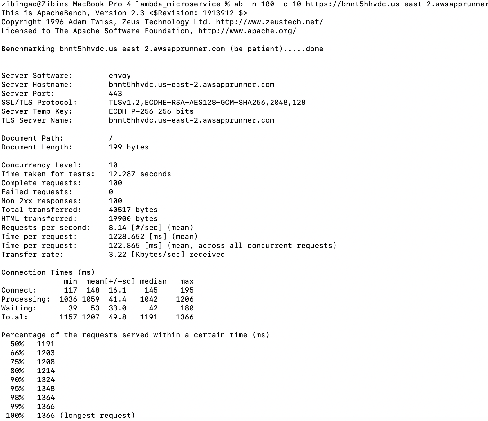
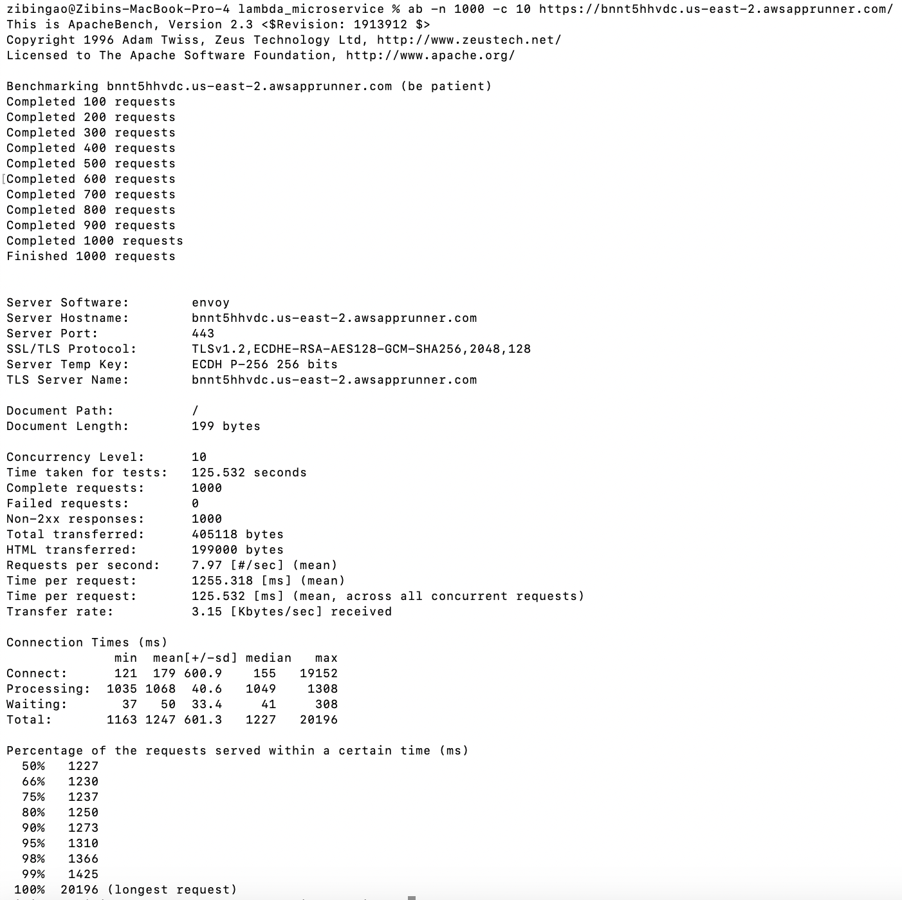
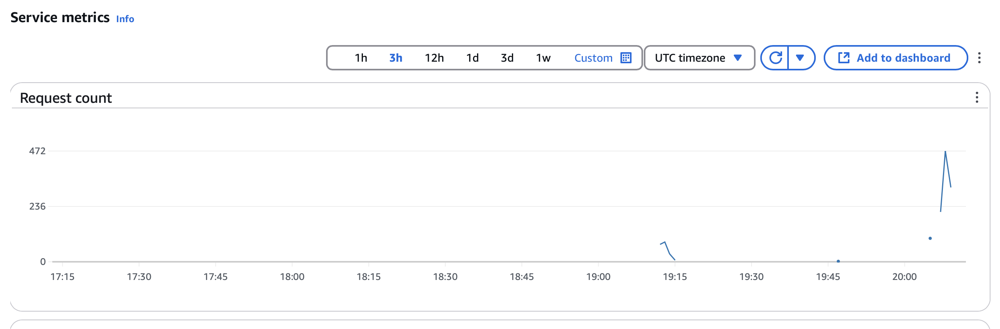

# IDS706 Final Project

## Continuous Integration with GitHub Actions
[](https://github.com/Reby0217/ids706-finalProject/actions/workflows/install.yml)
[](https://github.com/Reby0217/ids706-finalProject/actions/workflows/lint.yml)
[](https://github.com/Reby0217/ids706-finalProject/actions/workflows/format.yml)
[](https://github.com/Reby0217/ids706-finalProject/actions/workflows/test.yml)

---

This project is a microservice-based application that provides user authentication and profile management functionalities. It includes sign-up, login, and profile display features. Each time a user successfully signs up, their information is stored in the SQLite database.

Link to our app: https://bnnt5hhvdc.us-east-2.awsapprunner.com/


---

### How to Run the Application

You can set up and run the application using one of the following methods:

#### Option 1: Using Docker (Recommended)
1. Build the Docker image:
   ```bash
   make docker-build-front
   ```
2. Run the Docker container:
   ```bash
   make docker-run-front
   ```
3. Visit the application in your browser at: [http://localhost:5085/](http://localhost:5085/) 

---

#### Option 2: Using a Virtual Environment
1. Install `virtualenv`:
   ```bash
   pip3 install virtualenv
   ```
2. Create a virtual environment:
   ```bash
   virtualenv env
   ```
3. Activate the virtual environment:
   ```bash
   source env/bin/activate
   ```
4. Install the required dependencies:
   ```bash
   pip3 install -r requirements.txt
   ```
5. Set environment variables:
   ```bash
   export FLASK_APP=run.py
   export FLASK_ENV=development
   ```
6. Navigate to the `frontend` directory and run the application:
   ```bash
   cd frontend
   flask run
   ```
7. Visit the application in your browser at: [http://127.0.0.1:5000/](http://127.0.0.1:5000/)

---
### Data Engineering Compliance

This project utilizes **SQLAlchemy**, a Python SQL toolkit that allows developers to access and manage SQL databases using Pythonic domain language. All data is stored in a lightweight SQLite database located at `frontend/apps/db.sqlite3`.

1. **Database Management**:
   - The project defines and manages database models like `Users` and `OAuth` using SQLAlchemy, enabling efficient CRUD operations and managing relationships with `ForeignKey` and `relationship`.

   - **Users Table Overview**:
      - **id**: Unique identifier for each user (primary key).  
      - **username**: Unique username for the user.  
      - **email**: Unique email address.  
      - **password**: Securely hashed password.  
      - **oauth_github**: Optional GitHub OAuth identifier.  
      - **api_token**: Authentication token for API access.  
      - **api_token_ts**: Timestamp of token creation.

2. **Data Storage**:
   - User data, authentication tokens, and OAuth details are stored in the SQLite database, providing a portable and reliable storage solution.

3. **Authentication and Security**:
   - **hashlib** ensures secure password storage with hashing and salting techniques.  
   - **PyJWT** enables token-based authentication, generating and validating secure JSON Web Tokens.

4. **Data Validation and Querying**:
   - SQLAlchemy's query interface supports dynamic data retrieval and filtering, critical for user authentication and API workflows.  
   - Form inputs for login and registration are validated to ensure clean and consistent database records.  

---
### Load Test

#### Objective
To verify our microservice's capacity to handle significant traffic, we performed scaled-down load tests using Apache Bench.

#### Testing Method
- **100 Requests Test:**
  ```bash
  ab -n 100 -c 10 https://bnnt5hhvdc.us-east-2.awsapprunner.com/
  ```
   
- **1,000 Requests Test:**
  ```bash
  ab -n 1000 -c 10 https://bnnt5hhvdc.us-east-2.awsapprunner.com/
  ```
  

#### Rationale
Given the project's scope and budget constraints, tests with 100 and 1,000 requests were deemed sufficient to demonstrate the microservice’s scalability and performance capabilities. Testing up to the full requirement of 10,000 requests per second was considered cost-prohibitive for this academic exercise, as confirmed by our teaching assistant.

#### Results
Both tests confirmed efficient handling of increased loads, indicating that our service can scale up effectively when needed.


___

### Flask Integration

This project utilizes **Flask**, to build the application's core functionality. Flask serves as the foundation for handling HTTP requests, routing, and rendering dynamic web pages.

Key features include:

- **Routing and Modularization**: The application uses Flask Blueprints to organize features like authentication and API endpoints, ensuring a clean and maintainable structure.
- **Dynamic Templating**: Flask integrates seamlessly with HTML templates, enabling dynamic rendering of user interfaces.
- **API Integration**: RESTful APIs are implemented using Flask-RESTx to support robust data exchange and user authentication workflows.
- **OAuth Support**: GitHub OAuth login is integrated using Flask-Dance for secure third-party authentication.

---

### Infrastructure as Code (IaC) with AWS CDK

Our project utilizes the AWS CDK to define and provision our cloud infrastructure, ensuring a consistent, reliable, and secure setup across development, testing, and production environments. AWS CDK allows for declarative infrastructure management using familiar programming languages, enabling version control and reducing deployment errors.

#### Key Features:
- **DynamoDB Tables**: Managed NoSQL databases with specified partition keys.
- **Lambda Functions**: Serverless functions for backend operations such as data handling and user authentication.
- **Security**: Explicit permission definitions enhance security and compliance.

#### Code Snippet:
```python
demo_table = aws_dynamodb.Table(
    self, "user_info",
    partition_key=aws_dynamodb.Attribute(name="id", type=aws_dynamodb.AttributeType.STRING),
)

producer_lambda = aws_lambda.Function(
    self, "write_to_dynamodb_lambda_function",
    runtime=aws_lambda.Runtime.PYTHON_3_11,
    code=aws_lambda.Code.from_asset("./lambda/producer"),
)
```


---

### AI Pair Programming

GitHub Copilot: Used for auto-generating boilerplate code, optimizing frontend HTML files.

---


### Dependencies

- This project incorporates selected components of the **Soft UI Dashboard** template from [AppSeed](https://appseed.us/product/soft-ui-dashboard/flask/) as part of its website framework. 

- The AWS CDK is referenced from the official example in [aws-cdk-samples](https://github.com/aws-samples/aws-cdk-examples).